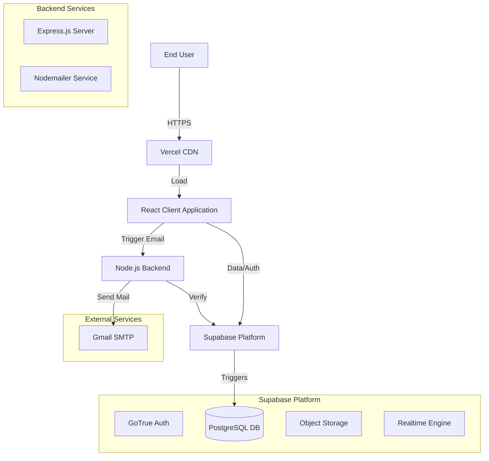

# Expert Office Furnish - Technical Architecture Documentation

**Date:** December 11, 2025
**Version:** 1.0.0
**Author:** Senior Systems Architect

---

## 1. High-Level System Overview

The **Expert Office Furnish** platform is a modern, decoupled e-commerce architecture designed for scalability, performance, and security. It utilizes a **Headless Commerce** approach where the frontend acts as a standalone client consuming data and services from Supabase (BaaS) for core data/auth and a custom Node.js backend for specialized business logic (email notifications, secure admin operations).

### System Data Flow

### Key Components
1.  **Frontend (Client):** A high-performance React application responsible for the shopping experience, state management, and direct database interactions via secure RLS policies.
2.  **Supabase (Data Layer):** Acts as the primary source of truth for Products, Users, Orders, and Analytics. It handles Authentication and Authorization (RLS).
3.  **Node.js Backend (Service Layer):** A supportive microservice handling privileged operations that cannot be safely exposed to the client, primarily **Transactional Emails** and **Server-Side Validation**.

---

## 2. Frontend Architecture

**Technology Stack:**
*   **Core:** React 18, Vite 5.x
*   **Styling:** Tailwind CSS 3.x, Lucide React (Icons)
*   **Routing:** React Router DOM v6
*   **State Management:** Context API (AuthContext, CartContext)
*   **HTTP Client:** `@supabase/supabase-js`, Native `fetch`

### Component Hierarchy & Rendering
The application follows a **feature-based directory structure** inside `src/`.
*   **`src/pages/`**: Route-level components (lazy-loaded where possible).
*   **`src/components/`**: Reusable UI atoms and molecules.
*   **`src/context/`**: Global state providers wrapping the root at `main.jsx`.

**Rendering Flow:**
1.  **Entry:** `main.jsx` initializes `AuthProvider` (checks session) and `CartProvider` (loads cart from storage).
2.  **Routing:** `react-router-dom` handles client-side routing. Use of `ProtectedRoute` wrapper ensures secure access to `/profile` and `/admin` routes.
3.  **Data Fetching:** Components utilize `useEffect` hooks to fetch data directly from Supabase.
    *   *Example:* `ProductPage.jsx` fetches product details + related items in parallel.

### State Management Strategy
*   **Auth State:** Managed via `AuthContext`. It listens to Supabase `onAuthStateChange` events to keep the UI in sync with the session token.
*   **Cart State:** Managed via `CartContext`. Persists to `localStorage` for guest persistence and synchronizes with database orders upon checkout.
*   **Local UI State:** standard `useState` / `useReducer` for form handling.

### Caching implementation
*   **Request Caching:** A custom `dataCache` utility (`utils/dataCache.js`) implements a simple in-memory LRU-like strategy.
    *   *Mechanism:* `Map<string, { data: any, timestamp: number }>`
    *   *Usage:* Stores product details and discount codes to prevent redundant network requests.
    *   *TTL:* Default 2 minutes (configurable).

### Security Considerations (Frontend)
*   **XSS Mitigation:** React's auto-escaping is leveraged. `dangerouslySetInnerHTML` is avoided.
*   **Route Protection:** `ProtectedRoute` component validates the user object before rendering children. Redirects unauthenticated users to `/login`.
*   **Environment Variables:** Public keys (Supabase URL/Key) are exposed via `import.meta.env`. Sensitive keys are strictly excluded from the client bundle.

---

## 3. Backend Architecture

**Framework:** Node.js / Express.js

The backend is designed as a **stateless REST API**. It does not maintain user sessions (stateless JWT validation) and focuses on "fire-and-forget" tasks.

### API Layer
*   **Middleware:**
    *   `helmet`: Security headers (HSTS, no-sniff).
    *   `cors`: Whitelisting allowed origins.
    *   `rateLimit`: Protecting against DoS/Brute-force (Window: 15m, Max: 100 reqs).
    *   `sanitizeRequest`: Custom middleware wrapping `xss-clean` and `mongo-sanitize` logic to scrub inputs.
    *   `requireApiKey`: Secures `/api/*` routes (except email) requiring a valid server-to-server key.

### Key Workflows

**1. Email Service Workflow:**
*   **Endpoint:** `POST /api/email/welcome`
*   **Trigger:** Client calls after successful Supabase `signUp`.
*   **Logic:**
    1.  Validates email format.
    2.  Check for existence of Company Logo file.
    3.  Builds HTML template with `cid` embedded images.
    4.  Sends via `nodemailer` (Gmail SMTP).

**2. Authentication Architecture (Hybrid):**
*   **Identity Provider:** Supabase Auth (GoTrue).
*   **Backend Role:** The backend does **not** issue tokens. It trusts Supabase to handle the identity lifecycle.
*   **Authorization:** The backend routes are protected mainly by API Keys (Service-to-Service trust) rather than User JWTs.

---

## 4. Supabase Architecture

**Role:** The core backend infrastructure.

### Database Schema (Public Schema)

**1. Users & Customers (Split Schema)**
*   `auth.users`: Managed by Supabase (Identity).
*   `public.customers`: Profile data for shoppers.
    *   `id` (FK to auth.users), `name`, `email`, `orders`, `spent`.
*   `public.users`: Profile data for Admins/Staff.
    *   `id` (FK), `role` ('admin', 'manager'), `status`.
*   *Trigger Logic:* `handle_new_user` PL/SQL function splits new registrations into specific tables.

**2. Products & Inventory**
*   `public.products`: `id`, `name`, `description`, `price`, `stock_quantity`, `category_id`, `additional_images` (JSONB).
*   `public.categories`: `id`, `name`, `slug`.

**3. Analytics (Real-time)**
*   `public.analytics_events`: High-volume table for `page_view`, `add_to_cart` events.
*   `public.analytics_sessions`: session duration and user journey tracking.
*   *Views:* `v_daily_analytics`, `v_top_products` aggregate data for the Admin Dashboard.

### RLS (Row Level Security) Policies
*   **Strict Security Model:**
    *   `customers`: Users can only `SELECT/UPDATE` their own rows (`auth.uid() = id`).
    *   `products`: Public `SELECT`. Admin `INSERT/UPDATE/DELETE`.
    *   `analytics_events`: `INSERT` allowed for Anon (public tracking). `SELECT` restricted to Authenticated (Admins).
    *   `reviews`: `INSERT` allowed for Authenticated. `SELECT` Public.

### Scalability
*   **DB Indexing:** Created on `email`, `created_at`, `product_id`, and `session_id`.
*   **Views:** Materialized-style views used to offload complex aggregations from the client.

---

## 5. Caching Strategy

A multi-layered caching strategy ensures sub-second load times.

| Layer | Technology | Strategy | TTL |
|-------|------------|----------|-----|
| **Browser** | HTTP Headers | `Cache-Control: max-age=31536000` for static assets. | 1 Year |
| **CDN** | Vercel Edge | Caches HTML/Assets at the edge. | Dynamic |
| **Application** | `dataCache.js` | In-memory Map for preventing re-fetching Products. | 2 Minutes |
| **Database** | Postgres Buffer | Frequently accessed tables (`products`) hot in memory. | N/A |
| **Query** | React State | `product` state prevents re-render unless ID changes. | Component Lifecycle |

**Invalidation:**
*   **Client Cache:** Automatically invalidates after 2 minutes or on page refresh.
*   **Browser Cache:** Invalidated via file hashing (Vite bundler) on new deployments.

---

## 6. System Processes

### User Login Process
1.  **Input:** User enters Email/Password.
2.  **Auth:** Client calls `supabase.auth.signInWithPassword`.
3.  **Token:** Supabase returns JWT (Access + Refresh).
4.  **State:** `AuthContext` updates user state.
5.  **Profile Fetch:** Client fetches `public.customers` profile.
6.  **Redirect:** User sent to Dashboard or Home.

### Checkout & Order Pipeline
1.  **Cart:** User adds items (stored in Context).
2.  **Order Creation:** Client inserts row into `public.orders` via Supabase SDK.
3.  **Payments:** (To be implemented) Stripe/Gateway integration.
4.  **Confirmation:** Client calls Backend `POST /api/email/order-confirmation` (Future).
5.  **Inventory:** Database trigger decrements `stock_quantity`.

### Analytics Event Flow
1.  **Trigger:** User views a Product Page.
2.  **Logic:** `useEffect` calls `trackProductView()`.
3.  **Ingest:** Inserts row into `public.analytics_events` (Anon allowed).
4.  **Process:** SQL Views (`v_top_products`) aggregate this data instantly.
5.  **Display:** Admin Dashboard queries `v_top_products` to show "Trending Items".

---

## 7. Full Deployment Architecture

### Frontend (Vercel)
*   **Build:** `vite build` produces static bundle (`dist/`).
*   **Config:** `vercel.json` handles rewrites for SPA routing.
*   **Environment:**
    *   `VITE_SUPABASE_URL`: Connection string.
    *   `VITE_SUPABASE_ANON_KEY`: Public key.

### Backend (Node.js Hosting)
*   **Platform:** Render / Vercel Serverless.
*   **Environment:**
    *   `HTTPS_PORT`, `PORT`: Server listeners.
    *   `EMAIL_USER`, `EMAIL_PASS`: SMTP Credentials.
    *   `CORS_ORIGINS`: Security whitelist.
    *   `API_KEY`: Service protection.

### Database (Supabase Cloud)
*   **Region:** Closest to target audience.
*   **Backups:** PITR (Point in Time Recovery) enabled.

### CI/CD Pipeline
1.  **Push:** Developer pushes to GitHub `main`.
2.  **Test:** GitHub Actions runs linting/tests.
3.  **Build:** Vercel auto-builds Frontend. Render auto-deploys Backend.
4.  **Verify:** Health checks (`/api/test`) confirm deployment success.

---

## 8. Performance Optimization

1.  **Code Splitting:** React `lazy()` used for route-level components (`AdminDashboard`, `AuthPage`).
2.  **Image Optimization:** Frontend uses specific sizes.
3.  **Prefetching:** `backgroundPrefetch` utility pre-loads critical resources during idle time (seen in `main.jsx`).
4.  **Debouncing:** Search and Resize handlers are debounced (`lodash.debounce`).
5.  **Parallel Fetching:** `Promise.all` used when fetching independent data.

---

## 9. Security Architecture

### Network Security
*   **TLS/SSL:** Forced HTTPS on all connections.
*   **HSTS:** Enabled via Helmet middleware.
*   **CORS:** Strict origin validation.

### Data Security
*   **RLS (Row Level Security):** The primary defense. Ensures users can literally *never* access data they don't own.
*   **Input Sanitization:** Middleware strips `$`, `.`, and malicious characters.
*   **Zod Validation:** Schema validation for API inputs.

### Authentication Security
*   **Cookies vs Storage:** Session management handled by Supabase.
*   **Password Hashing:** Handled internally by Supabase (Bcrypt).
*   **Rate Limiting:** Custom backend API protected by `express-rate-limit`.

---

## 10. Recommendations & Roadmap

1.  **Infrastructure:** Migrate Node.js backend to Supabase Edge Functions entirely to eliminate the need for a separate hosting provider.
2.  **Testing:** Implement end-to-end testing with Cypress or Playwright.
3.  **Monitoring:** Integrate Sentry for frontend error tracking.
